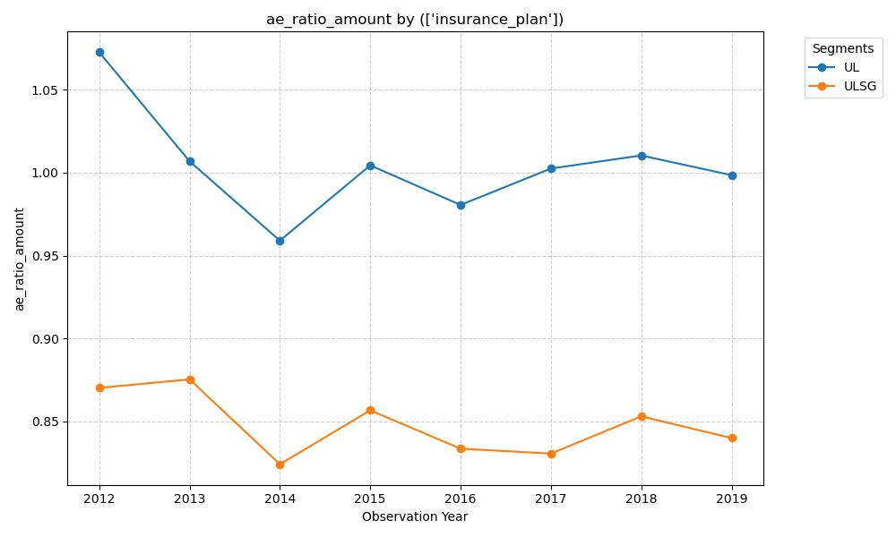

# Temporal Analysis of Mortality Improvement in Universal Life (UL) vs. ULSG

### Hypothesis
The report notes in Section 4 that UL mortality remains elevated compared to ULSG. I suspect that over the observation years, the gap between UL and ULSG A/E ratios will widen. This is likely due to the 'modernization' of the ULSG market and potential anti-selection or 'wear-off' of secondary guarantees on older UL policies issued in the 80s and 90s.

### Graph


### Insight
Based on the provided graph of Actual-to-Expected (A/E) ratios by amount and the ILEC data dictionary, here is an analysis of the trends, segment insights, and an evaluation of your hypothesis.

### 1. Analysis of Trends and New Insights

*   **Persistent Performance Gap:** The most striking insight is the consistent and significant vertical distance between the two lines. The ULSG A/E ratio fluctuates between approximately 0.82 and 0.88, while the UL ratio sits much higher, generally between 0.96 and 1.07. This suggests that the underlying risk profiles of these two "Universal Life" products are fundamentally different, despite sharing a common name.
*   **Correlation of Volatility:** Interestingly, the peaks and valleys for both segments largely mirror each other (e.g., the sharp dip in 2014 and the recovery in 2015). This indicates that both segments are being influenced by the same "exogenous" factors—likely a combination of broader population mortality fluctuations in those years and systemic reporting/valuation shifts within the ILEC data collection itself.
*   **Stabilization vs. Improvement:** While ULSG shows a very slight downward (improving) trend from 2012 to 2019, UL appears to have "flatlined" after an initial drop between 2012 and 2014. UL is essentially hovering around the 1.00 mark, meaning its mortality is tracking almost exactly with the VBT 2015 table, whereas ULSG is significantly outperforming the table.

### 2. Speculation on Mortality Drivers

**Why ULSG remains lower (Superior Performance):**
*   **Socio-Economic Selection:** ULSG is often a "high-ticket" estate planning tool. Looking at the `Face_Amount_Band` in your dictionary, ULSG policies often cluster in the higher bands (08–11). Higher face amounts are a known proxy for higher socio-economic status, which correlates with better access to healthcare and lower mortality.
*   **Underwriting Intensity:** Because ULSG carries significant long-term guarantees, carriers historically applied more rigorous medical underwriting compared to older UL products, leading to a "cleaner" block of business.
*   **Target Market:** The "modernization" you mentioned often involves target markets that are more insurance-literate and proactive about health management.

**Why UL remains higher (Elevated Mortality):**
*   **Anti-Selection and Policy Decay:** As UL policies from the 1980s and 90s age, healthy lives often surrender their policies or exchange them (1035 exchange) for newer, more efficient products (like ULSG). Those who are in poor health are more likely to keep their older UL policies active at any cost—a classic case of mortality anti-selection.
*   **The "Uni-Smoke" Factor:** Your data dictionary notes that `Smoker_Status` is set to "Uni-smoke" for `Issue_Year < 1981`. Older UL blocks likely contain many "unsmoker" or aggregate-rated lives. These lack the mortality advantages of the modern dynamic "Preferred Non-Smoker" classes found in ULSG.
*   **Lapse-Supported Pricing Issues:** Older UL policies without secondary guarantees are sensitive to interest rates. As rates stayed low, premiums rose, causing "healthy" lapses, leaving behind a "frail" residual population.

### 3. Comment on Your Hypothesis

**Hypothesis:** *The gap between UL and ULSG A/E ratios will widen over time due to ULSG modernization and UL anti-selection/wear-off.*

**Evaluation:** Your hypothesis is **partially supported** by the visual evidence, but with a nuance regarding the *velocity* of the widening.

*   **The Gap Exists:** You are correct that the gap is wide and UL remains elevated.
*   **Widening Trend:** If we compare 2012 (gap of ~0.20) to 2017/2018 (gap of ~0.17), the gap hasn't necessarily "widened" in a linear fashion; it has actually remained remarkably stable.
*   **Refinement:** The "widening" might be masked by the fact that the oldest, most anti-selective UL policies are finally rolling off the books (dying out) or hitting their `Attained_Age` limits (e.g., age 95 or 121), which stabilizes the A/E ratio. 

**Conclusion:** The data confirms that UL and ULSG should be treated as distinct risk classes for pricing and reserving. The "wear-off" you suspected is visible in the sense that UL cannot break below the 0.95 barrier, whereas ULSG enjoys the benefits of modern underwriting and a wealthier policyholder base.

### SQL Code:
```SELECT Observation_Year, Insurance_Plan, SUM(Death_Claim_Amount) / SUM(ExpDth_VBT2015_Amt) AS AE_Ratio_Amount, SUM(Amount_Exposed) AS Total_Amount_Exposed FROM ILEC_Mortality_Table WHERE Insurance_Plan IN ('UL', 'ULSG') GROUP BY Observation_Year, Insurance_Plan ORDER BY Observation_Year ASC, Insurance_Plan ASC```