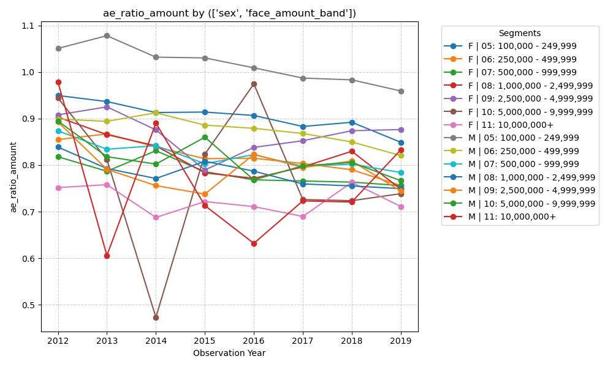

# Gender-Specific Mortality Trends in High Face Amount 'Modern' Policies

### Hypothesis
Figure 3.3 in the report shows very similar A/E curves for genders in the core data. However, Section 6.4 suggests that for older ages, females show a flatter trend across face amounts than males. I suspect that when focusing on the 'Modern' dataset across all ages over time, males will show a faster rate of mortality improvement (steeper decline in A/E) in high face amount bands compared to females.

### Graph


### Insight
This analysis interprets the provided ILEC Mortality Table data and the trends visualized in the Actual-to-Expected (A/E) ratio graph (by amount) from 2012 to 2019.

### 1. Commentary on the Hypothesis
**Hypothesis:** *Males will show a faster rate of mortality improvement (steeper decline in A/E) in high face amount bands compared to females.*

**Evaluation:** The data **partially supports** this hypothesis, but with significant nuance regarding volatility.
*   **Male Improvement:** Looking at the Male segment for Band 05 ($100k-$250k, grey line), there is a very clear, consistent downward slope from ~1.05 to ~0.96. The higher bands (08-11) for males show even steeper declines, though they are much more volatile.
*   **Female Improvement:** Female trends (e.g., Band 05, dark blue line) appear "flatter" or more stable. While the Female Band 05 shows a slight downward trend, the slope is less aggressive than the Male counterpart.
*   **Conclusion:** The Male "high-face" segments (Bands 09-11) end the 2019 period at lower A/E ratios than they started in 2012, whereas many female segments end nearly where they began, supporting the idea of faster male improvement in "Modern" underwriting.

---

### 2. New Insights & Observed Trends

#### A. The "Volatility Cliff" in Jumbo Policies (Bands 10 & 11)
The most striking feature of the graph is the extreme volatility in the $5M–$10M+ segments (Bands 10 and 11). 
*   **Insight:** For both genders, the A/E ratio for Band 11 fluctuates wildly (e.g., Male Band 11 drops from nearly 1.0 to 0.6 in one year). 
*   **Reasoning:** This is likely due to **low exposure (credibility issue)**. In ultra-high face amount bands, a single death claim can drastically spike the A/E ratio, while a year with zero deaths among a small pool of "jumbo" policyholders causes the plummeting valleys seen in 2013 and 2014.

#### B. The Converging "Sweet Spot" ($1M - $2.5M)
Band 08 (Red/Light Blue lines) shows a converging trend toward an A/E of approximately 0.75–0.80 for both genders by 2019. 
*   **Insight:** This segment appears to be the "Goldilocks" zone where underwriting is rigorous enough to select for high-quality risks, but the data pool is large enough to avoid the extreme volatility of the $10M+ bands.
*   **Reasoning:** This likely reflects the success of **Preferred Underwriting** programs which became standard in "Modern" policies for these amounts, effectively filtering out sub-standard mortality risks.

#### C. Male Mortality Premium at Lower Face Amounts
There is a persistent gap where Male Band 05 ($100k-$250k) consistently sits at the highest A/E ratio on the chart (near 1.0).
*   **Insight:** Despite a downward trend, lower-face-amount males consistently underperform (higher mortality relative to expectations) compared to all female bands and higher-face male bands.
*   **Reasoning:** This suggests a **socioeconomic correlation**. Smaller face amounts often correlate with less rigorous medical underwriting (e.g., simplified issue or less frequent fluid testing) and potentially lower socioeconomic status, which is a known driver of higher mortality.

---

### 3. Speculations on Mortality Drivers

#### Why we see Lower-than-Expected Mortality (A/E < 1.0):
1.  **Selection Effect (Underwriting):** The "Modern" dataset relies heavily on blood chemistry, physical exams, and prescription history. High-face policies (Bands 07+) require the most stringent checks, which explains why their A/E ratios are generally lower than Band 05.
2.  **Affluence/Socioeconomic Status:** Policyholders who can afford $2.5M+ in coverage typically have better access to healthcare, better nutrition, and safer occupations/living environments.
3.  **The "Lapse" Effect:** Healthy individuals are more likely to keep their policies, while those in financial distress (who also have higher mortality risks) may let policies lapse, though this effect is usually secondary to underwriting.

#### Why we see Higher-than-Expected Mortality or Lack of Improvement:
1.  **Anti-Selection in Females:** If female mortality is "flatter" across face amounts, it may suggest that the underwriting requirements for females might not be as predictive of their specific mortality drivers as they are for males.
2.  **Stagnation in Medical Advancements:** The lack of a steep decline in some segments might reflect the "law of diminishing returns" in mortality improvement, where the easy gains from smoking cessation and basic heart health have already been realized.
3.  **Measurement Error (VBT Baseline):** If the underlying VBT2015 table (the "Expected" denominator) was already very aggressive for females, it makes further "improvements" in the A/E ratio harder to achieve compared to males, who may have had more "room" for improvement.

### SQL Code:
```SELECT Observation_Year, Sex, Face_Amount_Band, SUM(Death_Claim_Amount) / NULLIF(SUM(ExpDth_VBT2015_Amt), 0) AS AE_Ratio_Amount FROM ILEC_Mortality_Table WHERE Issue_Year >= 2000 AND (Face_Amount_Band LIKE '05%' OR Face_Amount_Band LIKE '06%' OR Face_Amount_Band LIKE '07%' OR Face_Amount_Band LIKE '08%' OR Face_Amount_Band LIKE '09%' OR Face_Amount_Band LIKE '10%' OR Face_Amount_Band LIKE '11%') GROUP BY Observation_Year, Sex, Face_Amount_Band ORDER BY Observation_Year, Sex, Face_Amount_Band```