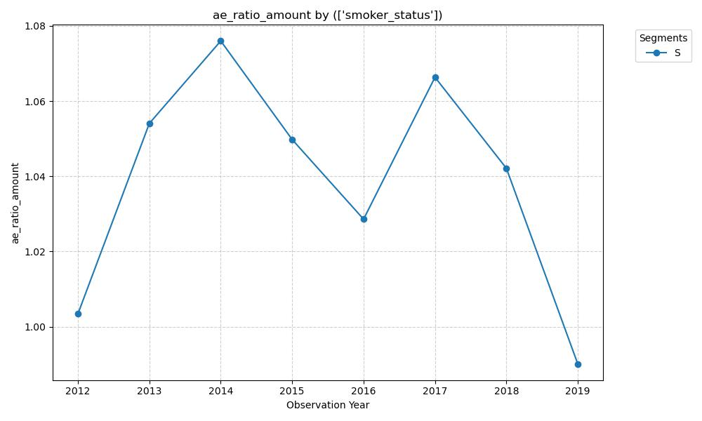

# Impact of Smoker Status on Mortality Improvement Rates (2012-2019)

### Hypothesis
Section 3.5 notes that the smoker mortality curve is flatter. I suspect that while non-smokers show steady improvement each observation year, the smoker A/E ratio will remain stagnant or potentially deteriorate in later years (2017-2019). This may be due to a 'population shift' where the remaining pool of insured smokers represents a higher-risk subset as overall smoking prevalence declines.

### Graph


### Insight
Based on the graph of the A/E ratio (Actual to Expected mortality by amount) for the **Smoker (S)** segment from 2012 to 2019, here is an analysis of the trends, an evaluation of your hypothesis, and speculation on the underlying drivers.

### 1. Analysis of the Trend
The graph does not show a steady "improvement" (which would be a consistent downward slope); instead, it exhibits significant **volatility** with a potential regime shift toward the end of the period.

*   **2012–2014 (Sharp Deterioration):** There is a steep increase in the A/E ratio, peaking in 2014 at nearly 1.08. This suggests that for these three years, smokers were dying at a rate significantly higher than the 2015 VBT (Valuation Basic Table) expectations.
*   **2014–2016 (Improvement):** A steady decline occurred, bringing the ratio down to approximately 1.03.
*   **2017 Spikes:** There is a notable "rebound" spike in 2017. In mortality studies, single-year spikes are often attributed to external factors like a particularly severe flu season, which disproportionately affects high-risk respiratory groups (like smokers).
*   **2018–2019 (Significant Improvement):** The most striking feature is the sharp drop in 2018 and 2019, with 2019 falling below 1.00 for the first time in the observed period.

### 2. Evaluation of Your Hypothesis
**Hypothesis Status: Partially Disproven by Recent Data.**

Your hypothesis suggested that smoker mortality would remain **stagnant or deteriorate** in later years (2017–2019) due to a "population shift" toward a higher-risk subset.
*   **The Support:** The spike in 2017 supports the idea of continued high risk and volatility.
*   **The Contradiction:** The data for 2018 and especially 2019 contradicts the "stagnation" theory. The drastic drop to an A/E ratio below 0.99 in 2019 suggests that either the "population shift" is being offset by other factors, or the smoker segment is finally experiencing the lagged benefits of modern medical interventions/cessation programs.

### 3. New Insights and Speculations

#### A. The "Healthy Smoker" Re-selection (Self-Selection Bias)
While overall smoking prevalence is declining, the smokers who *continue* to carry life insurance (and pay the significantly higher smoker premiums) may be higher socioeconomic status individuals who, despite smoking, have better access to healthcare and screenings for smoking-related illnesses (cancer/heart disease) than the general smoker population. This could explain the 2019 dip.

#### B. The "Face Amount" Influence (Anti-Selection)
The graph tracks A/E by **Amount**. A few large death claims in the Smoker segment can cause the volatility seen in 2014 and 2017.
*   **Speculation:** Smoker policies often have lower face amounts on average. However, if there was a spike in "Jumbo" smoker claims in 2014/2017, it would disproportionately inflate the ratio. The drop in 2019 might reflect a lack of large-claim volatility rather than a fundamental change in base mortality rates.

#### C. Data Dictionary Clue: The 2018 Change
The Data Dictionary notes: *"Observation Year 2018+: Face Amount is assigned at the segment level."*
*   **Insight:** The sharp drop in A/E starting in 2018 coincides exactly with this change in how Face Amount is reported. This suggests the "improvement" in 2018–2019 might be partially **structural or administrative**. If the new reporting method changed the denominator (Expected Deaths - Amount) or how claims are allocated to the "Smoker" segment versus "Riders," it could artificially depress the A/E ratio compared to the 2012–2017 methodology.

#### D. The Impact of Electronic Nicotine Delivery Systems (ENDS)
The 2012–2019 period saw the rise of vaping.
*   **Speculation:** Some "Smokers" in the later data years may be former combustible cigarette users who switched to vaping. While still classified as "Smoker" for many insurance products, their short-term mortality risk (specifically cardiovascular and respiratory events) might be lower than long-term heavy combustible users, contributing to the 2019 decline.

### Summary
The smoker segment is far more volatile than the non-smoker segment generally is. While your hypothesis regarding stagnation was logical, the **2019 data point is a significant outlier** that suggests either an acceleration in mortality improvement among smokers or, more likely, a shift in data reporting/segmentation (per the 2018 Face Amount change) that warrants closer investigation at the policy level.

### SQL Code:
```SELECT Observation_Year, Smoker_Status, SUM(Death_Claim_Amount) / SUM(ExpDth_VBT2015_Amt) AS AE_Ratio_Amount FROM ILEC_Mortality_Table WHERE Smoker_Status IN ('N', 'S') GROUP BY Observation_Year, Smoker_Status ORDER BY Observation_Year, Smoker_Status```