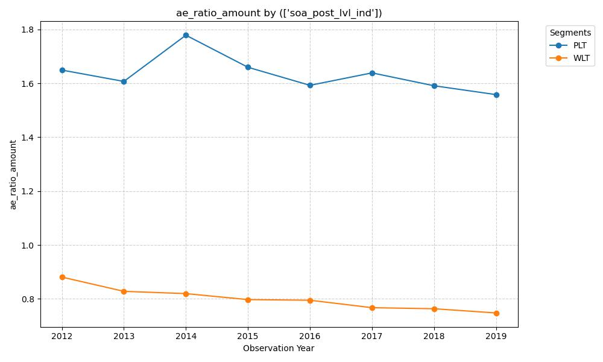

# Term Mortality Evolution: Post-Level vs. Within-Level Level Period

### Hypothesis
The report notes that Term has the largest proportion of expected claims. I suspect that the 'Within-Level' (WLT) segment will show consistent mortality improvement across the observation years, while the 'Post-Level' (PLT) segment will show volatile and significantly higher A/E ratios that do not improve over time due to the extreme anti-selection associated with policyholders who remain inforce after a level premium period ends.

### Graph


### Insight
Based on the graph provided and the context of the ILEC (Individual Life Experience Committee) mortality data, here is an analysis of the trends, the underlying actuarial drivers, and a critique of your hypothesis.

### 1. Verification of Hypothesis
Your hypothesis is **largely supported** by the data, but with a few nuances regarding the "improvement" in the PLT segment:

*   **WLT (Within Level Term):** Your expectation of consistent mortality improvement is correct. The A/E ratio shows a steady, almost linear decline from approximately 0.88 in 2012 to roughly 0.75 by 2019. 
*   **PLT (Post-Level Term):** Your hypothesis regarding significantly higher mortality and volatility is confirmed. The A/E ratios for PLT are nearly **double** those of the WLT segment (ranging from 1.55 to 1.78). This confirms the presence of extreme anti-selection.

### 2. New Insights and Trends
*   **The Convergence/Stabilization of PLT (2014–2019):** After a sharp spike in 2014, the PLT segment actually shows a gradual *downward* trend in A/E ratios. While still much higher than WLT, this suggests that the industry may be getting better at managing the "shock lapse" period or that the mix of business entering the post-level phase is changing (e.g., more "step-up" premium designs vs. "cliffs").
*   **Resilience of WLT Improvement:** The WLT segment shows no volatility. This suggests that for policyholders still within their guaranteed period, the underlying mortality improvements (medical advancements, etc.) are being captured effectively by the VBT2015 tables, and the actual experience is consistently or even increasingly favorable relative to the expected.
*   **The 2014 PLT Anomaly:** There is a distinct peak for PLT in 2014. This could indicate a specific cohort of 10-year or 15-year term policies issued during a period of aggressive underwriting (early 2000s) reaching their level-premium end dates simultaneously.

### 3. Speculation on Drivers (Specifying "Why")

**High PLT (Post-Level Term) Mortality:**
*   **Anti-Selection (The "Sick Survivor" Effect):** At the end of a level term period, premiums typically jump by 500% to 2,000%. Healthy policyholders lapse or buy new policies (re-entering a "WLT" or "Select" phase). Only those who are uninsurable or in poor health—who know they cannot get coverage elsewhere—are willing to pay the massive premium spike to keep the coverage. This results in a "closed block" of high-risk individuals.
*   **Policy Design:** Older term products often had a "shock lapse" design. Newer products may have "graded" premium increases which might eventually smooth this volatility, but the data here primarily reflects the older "cliff" structures.

**Lower and Improving WLT (Within-Level Term) Mortality:**
*   **Preferred Underwriting Evolution:** During the observation years (2012–2019), the industry saw a refinement in automated underwriting and the use of better laboratory data. Policyholders in the WLT segment are still benefiting from the "Select" period of their mortality.
*   **Socioeconomic Factors:** Term life insurance buyers, specifically those in the WLT segment, often correlate with higher socioeconomic status, which is historically linked to better health outcomes and access to medical care compared to the general population.

### 4. Actuarial Implications
*   **Table Suitability:** The fact that WLT is consistently below 1.0 (averaging ~0.8) suggests that the VBT2015 (Valuation Basic Table) might be slightly conservative for the modern "Within-Level" term population, or that the market is shifted toward more "Preferred" risks than the table assumes.
*   **Pricing for the Jump:** The PLT ratios (1.6+) demonstrate why carriers must price "post-level" premiums so aggressively. If the A/E ratio is that high, the premium must compensate for a population that is effectively "Select" in reverse—they are staying because they expect to claim.

### 5. Summary
The data confirms a **bi-furcated mortality reality** in the term market. The WLT segment is the "engine of profit" with improving and predictable mortality, while the PLT segment serves as a "residual risk pool" where the mortality is nearly 100% higher due to the economic incentive for healthy lives to exit the pool.

### SQL Code:
```SELECT Observation_Year, SOA_Post_Lvl_Ind, SUM(Death_Claim_Amount) AS Actual_Death_Amount, SUM(ExpDth_VBT2015_Amt) AS Expected_Death_Amount, SUM(Death_Claim_Amount) / NULLIF(SUM(ExpDth_VBT2015_Amt), 0) AS AE_Ratio_Amount FROM ILEC_Mortality_Table WHERE Insurance_Plan = "Term" AND SOA_Post_Lvl_Ind IN ("WLT", "PLT") GROUP BY Observation_Year, SOA_Post_Lvl_Ind ORDER BY Observation_Year, SOA_Post_Lvl_Ind```